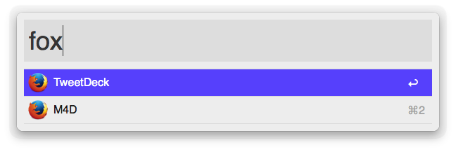
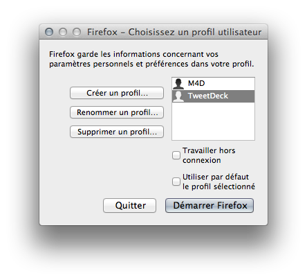

Firefox Profile Launcher (Alfred Workflow)
========================

Alfred workflow to launch Firefox/Aurora by choosing in existing profiles. Download the _alfredworkflow extension_ [here](https://raw.githubusercontent.com/m4dz/alfred-firefox-profile-launcher/master/alfred-firefox-profile-launcher.alfredworkflow).

Setup
-----

You can use multiple profiles in Firefox to sandbow your users or isolate your workflows.
To create a (or many) new profile(s), you must launch the Firefox ProfileManager. This workflow embed a shortcut to launch it : simply use the `fox` keyword and select `ProfileManager`into the list.

Use it to create/duplicate your profiles. They now become available in Firefox and then in the workfow.

Call
----

To call the workflow, use the `fox` keyword. It will show you all available profiles. Simply select the one that you want and it will launch Firefox with this profile selected. The keyword trigger accept filtering, so you can continue to type a partial for your desired profile name to refine the choices.

You can run as many instance as you want of Firefox, as long as each one use a separate profile.

Option
------

You can hold the `alt` key (`⌥`) when choosing a profile in the list to launch FirefoxAurora (Firefox Nigthly Chanel) instead of the stable version of Firefox with the selected profile.
